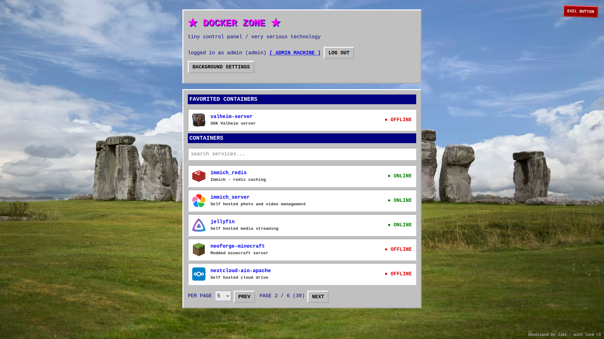
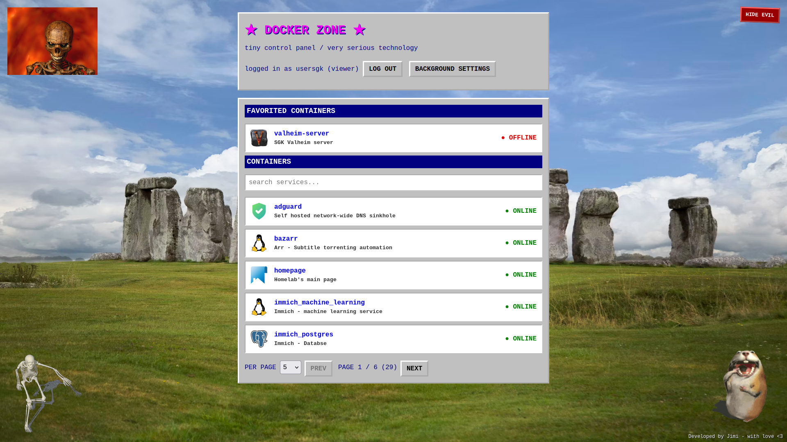
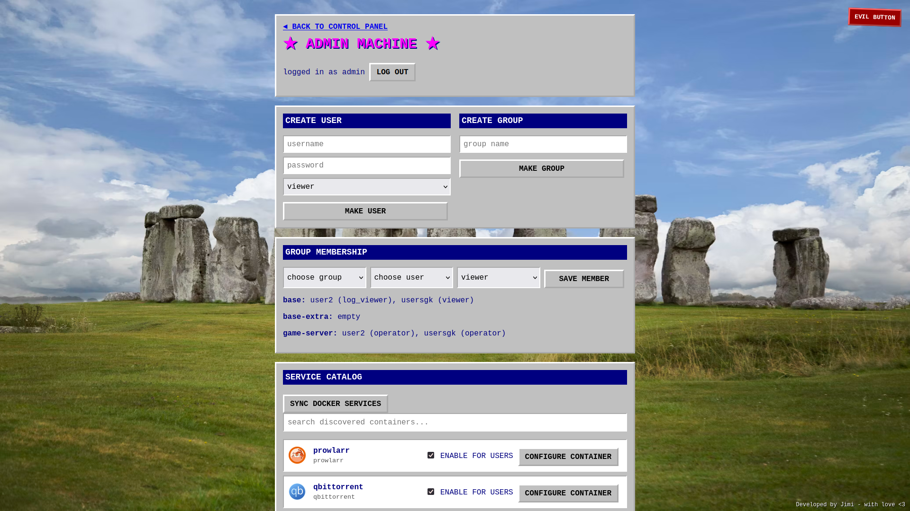
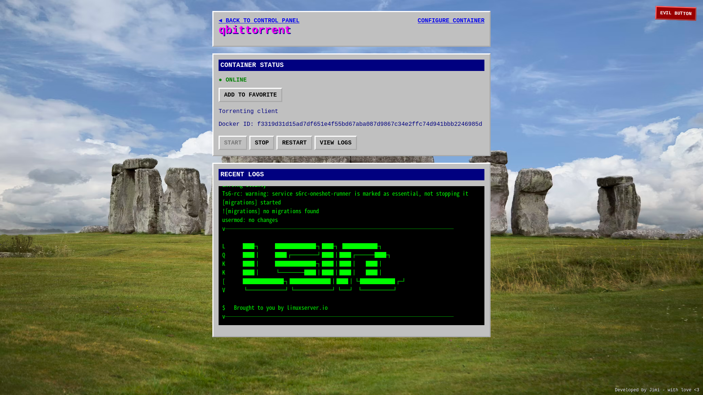

# Docker Zone

A small, deliberately old-school dashboard for Docker containers. Perfect for a homelab.



The backend is organized into:

- `cmd/dashboard`: application entrypoint and environment wiring.
- `internal/config`: server-wide YAML configuration loading.
- `internal/domain`: service entities shared by the application layers.
- `internal/docker`: Docker socket client/repository.
- `internal/httpapi`: REST handlers and static frontend serving.

The frontend keeps pages, reusable components, and their component styles in separate files under [`frontend/src/`](./frontend/src/).

## Run with Docker Compose (Recomended!)

The recommended home-server deployment mounts the host Docker socket into the dashboard container so it can inspect and manage configured containers:

```sh
cp .env.example .env
# Edit .env if needed, then:
docker compose up -d --build
```

Open <http://localhost:8080>. After pulling new changes, run the same command again to rebuild and recreate the container. Useful commands:

```sh
docker compose logs -f
docker compose ps
docker compose down
```

Compose reads deployment settings from the untracked `.env` file. The available settings are documented in [`.env.example`](./.env.example):

- `DASHBOARD_PORT` controls the host port.
- `LISTEN_ADDR` controls the address inside the container.
- `DOCKER_SOCKET` sets the host Docker socket path.
- `ADMIN_USERNAME` and `ADMIN_PASSWORD` bootstrap the first administrator.
- `DATABASE_DIR` sets the host directory containing the SQLite database.
- `DATABASE_PATH` sets the SQLite database path inside the container.
- `CONFIG_PATH` sets the server-wide YAML configuration path inside the
  container.

The dashboard background color and image URLs are personal browser settings available from the homepage and are stored in local storage. The evil overlay is hidden by default for each new browser and its toggle is also persisted locally.

Compose can provide a default client background for browsers without saved preferences using `DEFAULT_BACKGROUND_IMAGE` and `DEFAULT_BACKGROUND_SCALE` (`tile`, `stretch`, or `zoom`). These defaults do not overwrite existing browser preferences.

The server creates `/data/config.yml` on first startup. Edit that file on the host to change the title, icon, headings, footer, and optional evil overlay. Changes are picked up automatically. Evil image entries may be external URLs or files under `/data`. Local files are served through a restricted media endpoint.
Example `config.yml`:

```yaml
web:
  title: Docker Zone
  icon: https://cdn.jsdelivr.net/gh/selfhst/icons/svg/linux.svg
  header: "★ DOCKER ZONE ★"
  subheader: tiny control panel / very serious technology
  footer: "Developed by Jimi - with love <3"
evil: # optional
  images:
    - https://example.com/evil.gif
    - /data/evil/local-image.png
```

The first administrator is created only when the database has no users. Authentication uses server-side sessions in secure HTTP-only cookies. Services are protected by group membership and role permissions.

Administrators can open `/admin` to create users and groups, assign users to groups with `viewer`, `log_viewer`, or `operator` roles, and assign services to groups. Service assignments are stored in SQLite.

The dashboard discovers all Docker containers, including stopped containers. Newly discovered containers are disabled for regular users until an admin configures them. The `SYNC DOCKER SERVICES` button and startup synchronization refresh the catalog. Removed containers remain as orphaned SQLite records.

The Docker socket grants the dashboard broad control over the host Docker daemon. Keep this service on a trusted network and do not expose port 8080 directly to the public internet.

## Run locally (If you want)

1. Have Go 1.22+ and Node.js 18+ installed on your environment.
2. Build the frontend:

   ```sh
   cd frontend
   npm install
   npm run build
   cd ..
   ```

3. Start the dashboard:

   ```sh
   export ADMIN_USERNAME=admin
   export ADMIN_PASSWORD=change-this-password
   go run ./cmd/dashboard
   ```

Open <http://localhost:8080>. The process needs permission to access `/var/run/docker.sock`. Set `DOCKER_SOCKET` or `LISTEN_ADDR` to override the defaults.

The development frontend can run with `npm run dev` in `frontend/`; its Vite proxy forwards `/api` requests to the Go server.

## Screenshots


